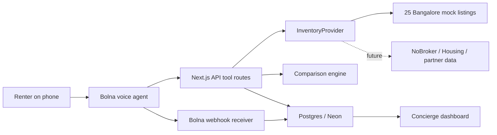

# Architecture

TheNiceBroker is an AI rental concierge for a NoBroker-style marketplace. The product solves one workflow: a renter calls, the agent extracts requirements, compares multiple rental units honestly, books visits, and sends a written summary.

## Problem

Rental marketplaces still rely on human relationship managers for high-volume requirement capture and follow-up. That creates three problems:

- Calls are expensive at scale.
- Renter trust is fragile because recommendations can feel sales-driven.
- Listing comparisons happen informally, so the operator dashboard loses the "why" behind each recommendation.

TheNiceBroker turns that workflow into a voice-first concierge with tool-backed search, structured comparison, and a human-readable dashboard.

## Primary Outcome Metric

Primary metric: percentage of qualified rental calls that produce at least one booked visit.

Business metric: cost per qualified visit.

Demo baseline:

- Relationship manager call: ₹200-₹400 per qualified call.
- AI concierge call: ₹15 estimated voice + infra cost.
- Target: lower cost per qualified visit while preserving renter trust.

Quality guardrails:

- Visit show-up rate.
- Complaint rate after summary.
- Percentage of calls where agent states at least one tradeoff.
- Percentage of calls where profile fields are complete enough for human handoff.

## System Diagram

## App Components

### Voice Layer

Bolna owns voice interaction, STT/TTS, agent orchestration, and function calling. The final prompt lives in `agent/system-prompt.md`.

### Tool API

Tool routes live under `src/app/api/agent/*`:

- `POST /api/agent/upsert-lead`
- `POST /api/agent/search`
- `POST /api/agent/compare`
- `POST /api/agent/book-visit`
- `POST /api/agent/send-summary`

Bolna lifecycle events arrive at:

- `POST /api/bolna/webhook`

### InventoryProvider

`InventoryProvider` is the abstraction between the app and data source. Today it uses 25 realistic Bangalore mock listings. Tomorrow it can use a NoBroker partnership feed, a Housing.com API, or a permissioned community dataset without changing the agent or dashboard.

### Comparison Engine

The comparison engine scores and compares listings across:

- Total monthly cost.
- Deposit.
- Carpet area.
- Furnishing.
- Parking.
- Building age.
- Amenities.
- Floor and lift.
- Tech park proximity.
- Metro proximity.
- Availability.

Every listing also has `caveats`, so honest tradeoffs are enforced by data shape and prompt rules.

### Dashboard

The dashboard gives operators:

- Concierge inbox with extracted renter profiles.
- Call detail view with transcript and tool reasoning.
- Listing comparison matrix.
- Booked visits calendar.
- Unit economics page.

If Neon is not configured or has no calls yet, the dashboard shows demo data. Once Bolna writes real events and tool calls, it switches to live DB data.

## Data Model

Core tables:

- `calls`: Bolna call lifecycle, recording URL, transcript JSON, cost.
- `leads`: structured renter profile extracted by the agent.
- `visits`: scheduled site visits.
- `shortlists`: listings recommended during a call and why.
- `agent_events`: append-only raw Bolna webhook payload log.

## Real Data Policy

The assignment ships with mock data on purpose. `bengaluru.rent` explicitly disallows scraping and AI extraction, so this repo does not scrape it. A future standalone product should use permissioned data through:

- NoBroker partnership.
- Housing.com / 99acres / MagicBricks official or partner feeds.
- Community-contributed rental data with explicit consent.
- A partnership with community projects that want an AI concierge layer.
